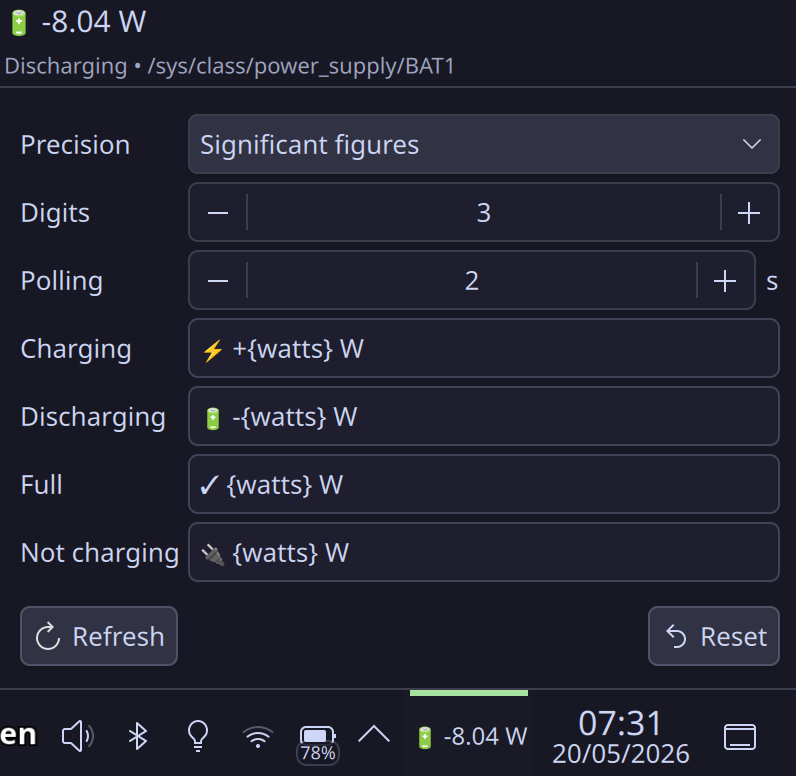

# Battery Watts

A minimal Plasma 6 plasmoid that reads your battery's **real-time power draw in watts** from sysfs and shows it in your panel.

## Features

- **Panel widget** — compact display of current power draw with auto-fitting text
- **Configurable popup** — customize precision, format, and polling interval
- **Custom format templates** — use `{watts}` in your own text patterns for each battery state
- **Auto-discovers battery** — works with BAT0, BAT1, BAT2, etc.
- **Polling interval** — update rate configurable from 1–60 seconds (default: 2s)
- **Two precision modes** — decimal places or significant figures
- **Refresh & Reset** — manual refresh or reset formats to defaults

## Screenshots

| Panel (compact) | Configuration popup |
|:---:|:---:|
|  |  |

## Requirements

- **Plasma 6** (tested on 6.6.x)
- **Linux** with a battery at `/sys/class/power_supply/BAT*`

Optional (only if building from source):
- **Qt 6** with QtQml headers
- **g++** and **qmake6**

## Installation

### Method 1: Install script (easiest — prebuilt binary)

```bash
git clone https://github.com/MintOcha/batterywatts-plasmoid.git
cd batterywatts-plasmoid
chmod +x install.sh
./install.sh
kquitapp6 plasmashell && sleep 2 && kstart plasmashell
```

Then right-click your panel → **Enter Edit Mode** → **Add Widgets** → search for "Battery Watts".

### Method 2: Manual install (prebuilt)

```bash
git clone https://github.com/MintOcha/batterywatts-plasmoid.git
cd batterywatts-plasmoid

# Install the plasmoid
kpackagetool6 --type Plasma/Applet --install .

# Install the native QML plugin
mkdir -p ~/.local/lib/qt6/qml/BatteryWatts
cp contents/code/libbatteryplugin.so ~/.local/lib/qt6/qml/BatteryWatts/
cp contents/code/qmldir ~/.local/lib/qt6/qml/BatteryWatts/

# Restart Plasma
kquitapp6 plasmashell && sleep 2 && kstart plasmashell
```

### Method 3: Build from source

```bash
git clone https://github.com/MintOcha/batterywatts-plasmoid.git
cd batterywatts-plasmoid

# Build the native plugin
cd contents/code
qmake6 batteryplugin.pro
make
cd ../..

# Install the plasmoid
kpackagetool6 --type Plasma/Applet --install .

# Install the QML plugin
mkdir -p ~/.local/lib/qt6/qml/BatteryWatts
cp contents/code/libbatteryplugin.so ~/.local/lib/qt6/qml/BatteryWatts/
cp contents/code/qmldir ~/.local/lib/qt6/qml/BatteryWatts/

# Restart Plasma
kquitapp6 plasmashell && sleep 2 && kstart plasmashell
```

## Format Templates

Each battery state has its own format string. Use `{watts}` as a placeholder for the numeric value:

| State | Default format | Example output |
|-------|---------------|----------------|
| Charging | `⚡ +{watts} W` | ⚡ +32.4 W |
| Discharging | `🔋 -{watts} W` | 🔋 -9.8 W |
| Full | `✓ {watts} W` | ✓ 0.0 W |
| Not charging | `🔌 {watts} W` | 🔌 0.5 W |

## How it works

The widget uses a small C++ plugin that reads from:

```
/sys/class/power_supply/BAT*/power_now   (in microwatts → divided by 1,000,000)
/sys/class/power_supply/BAT*/status      (Charging / Discharging / Full)
```

The battery is auto-discovered — no configuration needed.

## License

MIT
